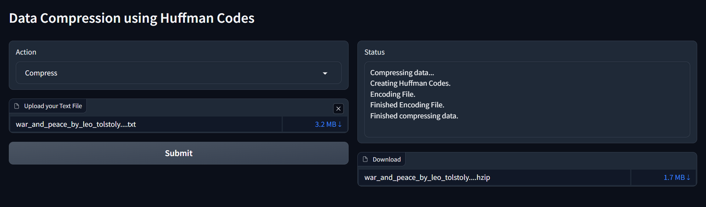

# Data Compression using huffman codes

A small python implementation of adaptive huffman coding to achieve data compression for ME 781 final project

## Installation

### Using Virtual Environment (Recommended)

create and activate a virtual environment using

```bash
python -m venv huffcom
source venv/bin/activate
```

install the required dependecies

```
pip install -r requirements.txt
```

## Usage

To setup the gradio UI on localhost run

```bash
python main.py
```



Choose action to either "Compress" or "Decompress" based on requirement, attach your txt file in the dropbox and click submit, you can download your decompressed file in 4-5 seconds

an example txt file is attached in books dir
